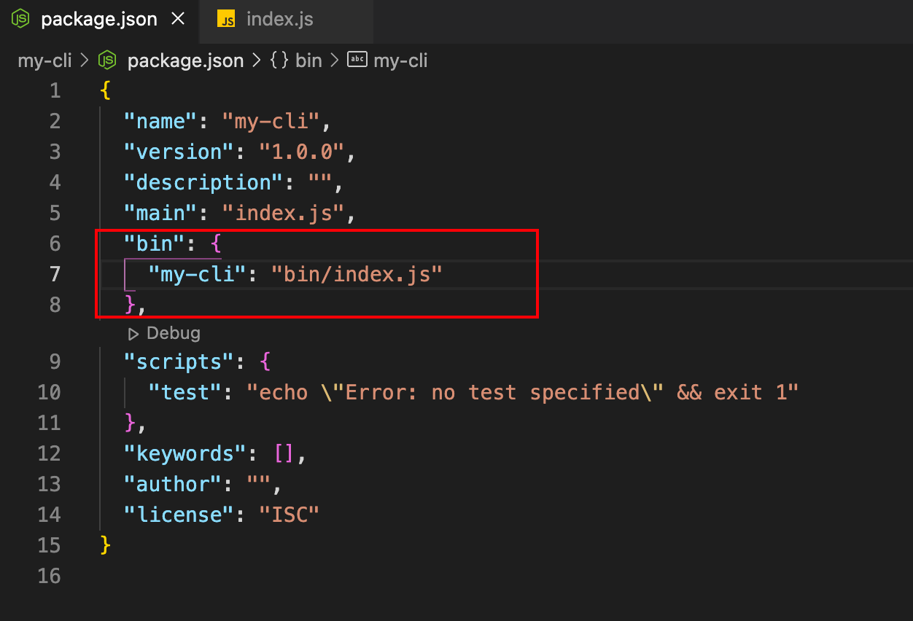

---

title: Node.js 养成计划（1）——自定义脚手架
date: 2023-02-25
---​

### 一、前端脚手架

#### 1、脚手架的简单介绍

​ 在前端工程化中，经常会使用到脚手架，比方说 react 项目的 CRA，或者 vue 项目的 vue-cli 等，那如果给脚手架做一个简单定义的话，可以理解为一个初始化项目的工具。

​ 往往在项目开发的前期，也就是初始化阶段，我们新建一个项目时，会做很多配置操作，而这些配置呢，又基本上是类似的（如团队的代码规范、语法检查等），我们完全可以尝试“偷懒”，用一行命令，初始化项目，配置环境，安装依赖等一系列前期工作。

#### 2、脚手架的基本功能

1）全局命令执行、命令行交互；

2）创建项目初始化代码和目录文件

### 二、自定义脚手架

我们在知道脚手架的功能之后，那我们就可以开始着手自定义一个符合自身需求的脚手架，用来初始化项目。那如何去实现一个自定义脚手架呢？我们可以从以下几个思路入手：

#### 1、创建自定义全局命令

比如 CRA，vue-cli，这些脚手架我们在使用时就是在命令行敲了一个全局命令，进行操作，所以我们如果要自定义一个脚手架，也需要实现这样的全局命令；

#### 2、命令行参数接收处理、终端交互

脚手架会有命令行交互，我们就需要接受命令行参数，做一系列的处理。比如是否使用 ts，项目名是什么等一系列的交互行为

#### 3、下载远程项目代码

我们需要将一个初始化的项目模版放到远程仓库，那脚手架就应该可以下载远程模版代码到本地

为了实现以上的操作，我们使用到的基本的几个第三方依赖主要有：

- commander: 强大的 node 命令行处理工具。能轻松的获取命令行的参数。
- inquirer: 命令行交互工具，能以“问答”的交互方式来完成一系列的命令行操作。
- download-git-repo: git 仓库下载工具，通常用来下载模板代码。

### 三、正式开始

#### 1、新建项目

一个 node 项目我们创建一个空文件夹，我们在项目根目录执行：

```shell
npm init -y
```

快速初始化，得到 package.json，如图所示，这个文件的作用就不再赘述了。


#### 2、创建全局命令

第一个关键步骤来了，我们需要将我们的脚手架工具作为一个全局命令，比方说可以在命令行中使用

```
my-cli xxx
```

来进行后续的一系列操作，第一步就是在之前创建的 package.json 文件中，**增加一个 bin 字段**

在安装时，npm 会将文件符号链接到 prefix/bin 以进行全局安装或./node_modules/.bin/本地安装。这样，就可以全局使用了。

例如，下面的将 my-cli 作为命令名称，执行文件是 bin 目录下的 index.js



那我们紧接着创建一个 bin 目录，并且创建一个 index.js 文件，这里要注意看下图的文件第一行：

```
#!/usr/bin/env node
```

这段代码是告诉你的脚本工具(bash/zsh), 下面的内容是要在 node 环境下运行的代码


最后我们再使用 npm link，它可以把指定的执行文件链接到全局，然后我们就可以在任意命令行来使用我们的脚手架工具了，


这里可以看到，在命令行中输入 my-cli，回车就会执行我们的 index.js 代码，然后输出我们所设定的内容。

#### 3、命令行参数的获取

​ 脚手架工具在使用时，常常会需要自定义参数，或者有命令行交互来制定一系列的行为。那我们如果想要获取到命令行参数，可使用 node.js 中的 process 对象，也可以使用一个非常常用的第三方库（**commander**）来获取命令行参数

​ commander 用法如下：

**1）.command(‘init [name]’, ‘init a project’, opts)**

​ 功能：注册一个命令。

​ 第一个参数：设置的命令的名称，后面可以跟参数，<> 表示必选参数，[]表示可选参数

​ 第二个参数: 命令的描述，可选，注意，当有第二个参数时，不能显示的调用 action 作为命令的回调，需要使用独立的可执行文件作为命令

​ 第三个参数：配置参数，如 noHelp，isDefault 等 .option(’-n, --name | [name]’, ‘desc’, ‘GK’)

功能：定义命令选项，（类似命令的额外参数， 用于辅助命令）

**2）.description(‘this is a command desc’)**
功能：命令的描述， 同时会应用到命令的帮助信息中，使用 help 命令时会显示
**3） .action(cb)**

命令的回调函数

**4）.parse()**

命令行参数解析， 通常用于最后 e.g

比如我们想要创建一个 create 命令，用于表示创建一个项目，并且可以使用-t 或者--typescript 来指明项目是否需要使用 typescript，可以看到 action 的回调函数中，我们就可以获取到用户在命令行使用时传入的参数，从而进行后续操作

****

#### 4、命令行交互

​ 常用的脚手架，一般都会有一些命令交互，让使用者自行选择或者输入，从而确认项目初始化的信息。这里我们就可以使用另一个第三方库**inquirer**来进行命令行交互的操作，我们可以在 action 中进行命令行交互，然后做出后续操作，inquirer 这个库的使用可以在对应的 github 进行查找，例子如下：


5、远程仓库代码下载

我们获取到用户输入的命令行参数，下一步就是根据用户的选择，进行指定的模版下载，那这里就需要使用到另一个第三方库**download-git-repo**，可以用来下载 github, gitlab 等远程仓库的代码，使用非常简单：

```javascript
download(repository, destination, options, callback);
```

其中：

repository: 远程仓库的地址

destination：下载到本地的路径

options: 配置参数

callback: 回调函数 需要注意一下

我们可以将模板分配到不同的分支，然后通过分支来下载不同模板。回调函数中会返回下载的结果，根据结果可以做出不同状态的处理。例如，根据返回状态判断是否下载成功，下载成功后提示是否要进行其他操作

#### 5、总结

​ 到这一步，我们最最简单的脚手架就完成了。命令行执行指定命令，获取参数，拉取模板代码，基本就是这些操作。

​ 只是说，我们的命令行的输入一点也不好看，没有下载中的提示，没有五彩斑斓醒目的文字等，这个时候 ora 和 chalk 两个库这时就起作用了。ora 可以美化命令行的 loading，是转圈圈，还是动态的小点点，还是自定义的 gif 都可以满足；chalk 就可以让你的命令行文字有了颜色，失败的红色告警，成功的绿色提示等

​ 具体脚手架的一个比较大的部分就是远程的模版，我们需要按照需求做好比较通用的，然后用于脚手架下载即可。
