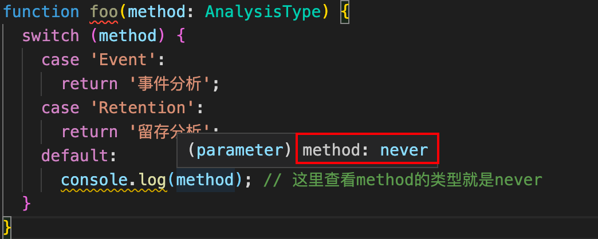
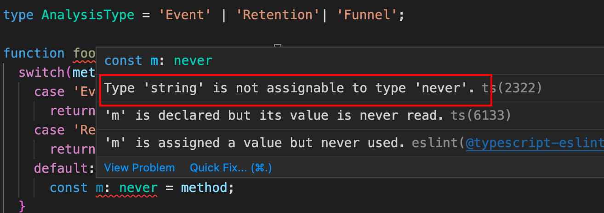
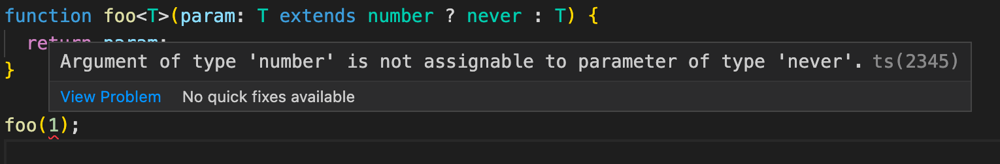

---

title: Ts 中的 never 类型
date: 2023-02-25
---​

### 一、什么是 never 类型

来一段官方说明：The `never` type represents values which are _never_ observed.

简单说就是永远到不了的类型（讲了跟没讲一下），举个例子：

```typescript
type A = number & string;
```

number 类型和 string 类型不可能有交集，所以把他们联合起来的类型就是`never`

再举个例子：

```typescript
type AnalysisType = 'Event' | 'Retention';

function foo(method: AnalysisType) {
  switch (method) {
    case 'Event':
      return '事件分析';
    case 'Retention':
      return '留存分析';
    default:
      console.log(method); // 这里查看method的类型就是never
  }
}
```



很明显，method 目前只有两种情况，ts 会自动做类型收紧，本身 switch 语句在这种情况下，是一定不会到 default 中的，所以此时的 method 是`never`类型

### 二、never 类型的特点

1、`never`类型是所有类型的子类型，即`never`类型可以赋值给任何类型。

2、其他任何类型均不是`never`类型的子类型，即其他类型均不可赋值给`never`类型，除了`never`本身。即使`any`类型也不可以赋值给`never`类型。

3、返回类型为`never`的函数中，其终点必须是不可执行的，例如函数过程中抛出了错误或者存在死循环。

4、变量也可以声明为`never`类型，但其不能被赋值。（当赋值时就会出现错误，可用于提前发现错误）

### 三、never 类型的使用

#### 1、使得联合类型更安全

如上面的`foo`函数，目前是`method`参数只有两种情况，但是鬼知道以后会不会加内容，那么就会跑到 default 中去，现在是知道这里要改动，万一后续代码量大起来，可能就忘记这里会走到 default 去，然后执行奇奇怪怪的操作。这个时候我们就可以在 default 这里做处理，使得 ts 编译报错，从而发现问题

```typescript
type AnalysisType = 'Event' | 'Retention' | 'Funnel';

function foo(method: AnalysisType) {
  switch (method) {
    case 'Event':
      return '事件分析';
    case 'Retention':
      return '留存分析';
    default:
      const m: never = method;
  }
}
```



此时就会出现不能将 string 类型的变量赋值给 never 类型，也就达到了我们的目的

#### 2、定义一些接口

有时候常常我们会有一些对象的类型定义是这样的：一定有某个键，它的类型是已知的，其他键名不知道，但是值都是一个类型。此时如何定义呢？

```typescript
interface CombineData {
  group_cols_name: string[];
  [indicator: string]: number[];
}
//error:Property 'group_cols_name' of type 'string[]' is not assignable to 'string' index type 'number[]'.
```

常见错误如上，也是非常明显的错误

其中`group_cols_name`属性是`string[]`类型，这与索引签名的`number[]`类型是不兼容的，因此是错误的。

1）一种方式，把索引类型改为`number[]|string[]`

这样有一个问题，就是除了`group_cols_name`外，其他的键对应的值类型被扩大了，被认为是字符串数组或者是数字数组了，但实际上我们又知道一定是字符串数组，所以后续都需要用到`as`关键字来断言。

2）另一种方式，使用联合类型，这个时候就派出`never`了

```typescript
interface CombineGroupData {
  group_cols_name: string[];
}
interface CombineGroupOther {
  group_cols_name: never;
  [key: string]: number[];
}
type CombineData = CombineGroupData | CombineGroupOther;
```

首先接口`CombineGroupData`定义了`group_cols_name`属性为`string[]`类型，然后接口`CombineGroupOther`将`group_cols_name`属性设置为`never`类型，由于`never`类型是任何类型的子类型，因此是不会和下面的索引签名的`number[]`类型冲突的，并且经过类型联合也是不会冲突的，因此通过类型联合将`group_cols_name`属性扩张为`string[]`类型，就可以实现我们想要的类型

#### 3、排除特定类型

假如你要定义一个这样的函数：**该函数的参数不能为数字类型，但可以是其他的任何类型**。意思就是得排除数字类型的参数。

不用`never`我们可能会这么实现：

```typescript
function foo(param) {
  if (typeof param === 'number') {
    throw new Error('参数不能是数字类型');
  }

  return param;
}
```

这么做当然没有问题，但是这样有一个不好的点，就是把函数发生错误的时间延后了，到执行时才会报错。有没有可能把错误时间提前到编译时呢？这个时候我们又可以使用`never`了

```typescript
function foo<T>(param: T extends number ? never : T) {
  return param;
}
```



经过改造之后，这个函数将接收一个泛型 T，再给参数 param 的类型加了个条件判断：`如果接收到的泛型 T 是 number 类型就给它赋值为 never 类型，否则直接使用这个泛型 T`，这样一来就达到目的了。

当咱们给它传一个 `number` 类型参数的时候，由于类型约束的存在，`T extends number` 这个条件被满足，于是 param 参数就变成了一个 `never` 类型，而 `never` 类型是不能接收 `number` 类型参数的。此时，编译器就报错了。

当然，我们可以实现的更为通用一点，即排除某个我们想要的类型

```typescript
type ExcludeType<T, U> = T extends U ? never : T;

function call<T>(param: ExcludeType<T, number>) {
  return param;
}
```

到这，`never`常用的场景差不多都有了。结束！
