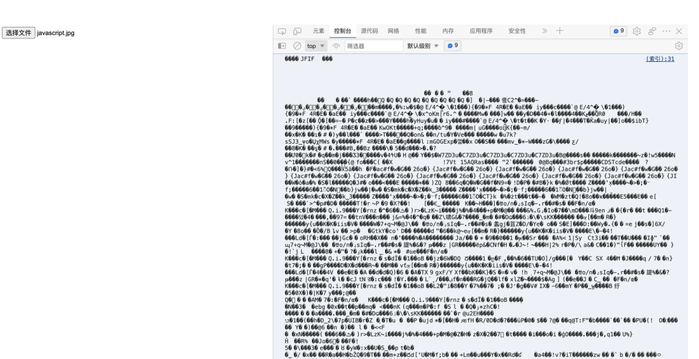
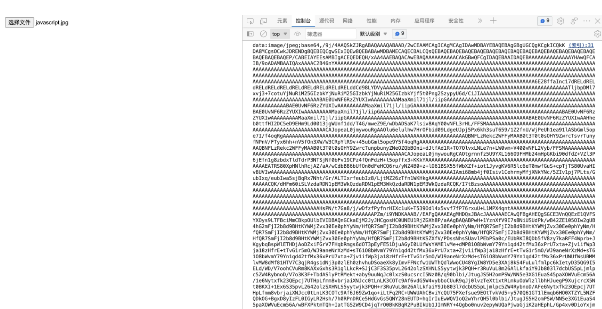

---

title: JS 中的二进制(上)
date: 2022-09-30
---​

JavaScript 提供了一些 API 来处理文件或原始文件数据。

例如：File、Blob、FileReader、ArrayBuffer、base64 等。

本文就一起来看看它们都是如何使用的，它们之间又有何区别和联系。

## 1. Blob

Blob 全称为 binary large object ，即二进制大对象，它是 JavaScript 中的一个对象，表示原始的类似文件的数据。下面是 MDN 中对 Blob 的解释：

> Blob 对象表示一个不可变、原始数据的类文件对象。它的数据可以按文本或二进制的格式进行读取，也可以转换成 [ReadableStream](https://developer.mozilla.org/zh-CN/docs/Web/API/ReadableStream) 来用于数据操作。

实际上，Blob 对象是包含有只读原始数据的类文件对象。简单来说，Blob 对象就是一个不可修改的二进制文件。

### （1）Blob 创建

可以使用 Blob() 构造函数来创建一个 Blob：

```javascript
new Blob(array, options);
```

其有两个参数：

- `array`：由 `ArrayBuffer`、`ArrayBufferView`、`Blob`、`DOMString` 等对象构成的，将会被放进 `Blob`；
- `array`：可选参数它可能会指定如下两个属性
  - `type`：默认值为 ""，表示将会被放入到 `blob` 中的数组内容的 MIME 类型。
  - `endings`：默认值为"`transparent`"，用于指定包含行结束符`\n`的字符串如何被写入，不常用。

常见的 MIME 类型如下：

| **MIME 类型**    | **描述**        |
| ---------------- | --------------- |
| text/plain       | 纯文本文档      |
| text/html        | HTML 文档       |
| text/javascript  | JavaScript 文件 |
| text/css         | CSS 文件        |
| application/json | JSON 文件       |
| application/pdf  | PDF 文件        |
| application/xml  | XML 文件        |
| image/jpeg       | JPEG 图像       |
| image/png        | PNG 图像        |
| image/gif        | GIF 图像        |
| image/svg+xml    | SVG 图像        |
| audio/mpeg       | MP3 文件        |
| video/mpeg       | MP4 文件        |

下面来看一个简单的例子：

```javascript
const blob = new Blob(['Hello World'], { type: 'text/plain' });
```

这里可以成为动态文件创建，其正在创建一个类似文件的对象。这个 blob 对象上有两个属性：

- `size`：Blob 对象中所包含数据的大小（字节）；
- `type`：字符串，认为该 Blob 对象所包含的 MIME 类型。如果类型未知，则为空字符串。

下面来看打印结果：

```javascript
const blob = new Blob(['Hello World'], { type: 'text/plain' });

console.log(blob.size); // 11
console.log(blob.type); // "text/plain"
```

注意，字符串"Hello World"是 UTF-8 编码的，因此它的每个字符占用 1 个字节。

到现在，Blob 对象看起来似乎我们还是没有啥用。那该如何使用 Blob 对象呢？可以使用 URL.createObjectURL() 方法将将其转化为一个 URL，并在 Iframe 中加载：

```javascript
<iframe></iframe>;

const iframe = document.getElementsByTagName('iframe')[0];

const blob = new Blob(['Hello World'], { type: 'text/plain' });

iframe.src = URL.createObjectURL(blob);
```

### （2）Blob 分片

除了使用`Blob()`构造函数来创建 blob 对象之外，还可以从 blob 对象中创建 blob，也就是将 blob 对象切片。Blob 对象内置了 slice() 方法用来将 blob 对象分片，其语法如下：

```javascript
const blob = instanceOfBlob.slice([start [, end [, contentType]]]};
```

其有三个参数：

- `start`：设置切片的起点，即切片开始位置。默认值为 0，这意味着切片应该从第一个字节开始；
- `end`：设置切片的结束点，会对该位置之前的数据进行切片。默认值为`blob.size`；
- `contentType`：设置新 blob 的 MIME 类型。如果省略 type，则默认为 blob 的原始值。

下面来看例子：

```javascript
const iframe = document.getElementsByTagName('iframe')[0];

const blob = new Blob(['Hello World'], { type: 'text/plain' });

const subBlob = blob.slice(0, 5);

iframe.src = URL.createObjectURL(subBlob);
```

此时页面会显示"Hello"。

## 2. File

文件（File）接口提供有关文件的信息，并允许网页中的 JavaScript 访问其内容。实际上，File 对象是特殊类型的 Blob，且可以用在任意的 Blob 类型的 context 中。Blob 的属性和方法都可以用于 File 对象。

> 注意：File 对象中只存在于浏览器环境中，在 Node.js 环境中不存在。

在 JavaScript 中，主要有两种方法来获取 File 对象：

- `<input>` 元素上选择文件后返回的 FileList 对象；
- 文件拖放操作生成的 `DataTransfer` 对象；

### （1）input

首先定义一个输入类型为 file 的 `input` 标签：

```javascript
<input type="file" id="fileInput" multiple="multiple">
```

这里给 `input` 标签添加了三个属性：

- `type="file"`：指定 `input` 的输入类型为文件；
- `id="fileInput"`：指定 `input` 的唯一 id；
- `multiple="multiple"`：指定 `input` 可以同时上传多个文件；

下面来给 `input` 标签添加 `onchange` 事件，当选择文件并上传之后触发：

```javascript
const fileInput = document.getElementById('fileInput');

fileInput.onchange = (e) => {
  console.log(e.target.files);
};
```

当点击上传文件时，控制台就会输出一个 FileList 数组，这个数组的每个元素都是一个 File 对象，一个上传的文件就对应一个 File 对象：每个 `File` 对象都包含文件的一些属性，这些属性都继承自 Blob 对象：


- `lastModified`：引用文件最后修改日期，为自 1970 年 1 月 1 日 0:00 以来的毫秒数；
- `lastModifiedDate`：引用文件的最后修改日期；
- `name`：引用文件的文件名；
- `size`：引用文件的文件大小；
- `type`：文件的媒体类型（MIME）；
- `webkitRelativePath`：文件的路径或 URL。

通常，我们在上传文件时，可以通过对比 size 属性来限制文件大小，通过对比 type 来限制上传文件的格式等。

### （2）文件拖放

另一种获取 File 对象的方式就是拖放 API，这个 API 很简单，就是将浏览器之外的文件拖到浏览器窗口中，并将它放在一个成为拖放区域的特殊区域中。拖放区域用于响应放置操作并从放置的项目中提取信息。这些是通过 `ondrop` 和 `ondragover` 两个 API 实现的。

下面来看一个简单的例子，首先定义一个拖放区域：

```javascript
<div id="drop-element"></div>
```

然后给这个元素添加 `ondragover` 和 `ondrop` 事件处理程序：

```javascript
const dropElement = document.getElementById('drop-element');

dropElement.ondragover = (e) => {
  e.preventDefault();
};

dropElement.ondrop = (e) => {
  e.preventDefault();
  const files = e.dataTransfer.files;
  console.log(files);
};
复制代码;
```

**注意**：这里给两个 API 都添加了 `e.preventDefault()`，用来阻止默认事件。它是非常重要的，可以用来阻止浏览器的一些默认行为，比如放置文件将显示在浏览器窗口中。

当拖放文件到拖放区域时，控制台就会输出一个 FileList 数组，该数组的每一个元素都是一个 `File` 对象。这个 FileList 数组是从事件参数的 `dataTransfer` 属性的 `files` 获取的

这里得到的 `File` 对象和通过 `input` 标签获得的 `File` 对象是完全一样的。


## 3. FileReader

FileReader 是一个异步 API，用于读取文件并提取其内容以供进一步使用。FileReader 可以将 Blob 读取为不同的格式。

> 注意：FileReader 仅用于以安全的方式从用户（远程）系统读取文件内容，不能用于从文件系统中按路径名简单地读取文件。

### （1）基本使用

可以使用 FileReader 构造函数来创建一个 FileReader 对象：

```javascript
const reader = new FileReader();
复制代码;
```

这个对象常用属性如下：

- `error`：表示在读取文件时发生的错误；

- `result`：文件内容。该属性仅在读取操作完成后才有效，数据的格式取决于使用哪个方法来启动读取操作。

- `readyState`：表示`FileReader`状态的数字。取值如下：

  | **常量名** | **值** | **描述**               |
  | ---------- | ------ | ---------------------- |
  | EMPTY      | 0      | 还没有加载任何数据。   |
  | LOADING    | 1      | 数据正在被加载。       |
  | DONE       | 2      | 已完成全部的读取请求。 |

FileReader 对象提供了以下方法来加载文件：

- `readAsArrayBuffer()`：读取指定 Blob 中的内容，完成之后，`result` 属性中保存的将是被读取文件的 `ArrayBuffer` 数据对象；
- `FileReader.readAsBinaryString()`：读取指定 Blob 中的内容，完成之后，`result` 属性中将包含所读取文件的原始二进制数据；
- `FileReader.readAsDataURL()`：读取指定 Blob 中的内容，完成之后，`result` 属性中将包含一个`data: URL` 格式的 Base64 字符串以表示所读取文件的内容。
- `FileReader.readAsText()`：读取指定 Blob 中的内容，完成之后，`result` 属性中将包含一个字符串以表示所读取的文件内容。

可以看到，上面这些方法都接受一个要读取的 blob 对象作为参数，读取完之后会将读取的结果放入对象的 `result` 属性中。

### （2）事件处理

FileReader 对象常用的事件如下：

- `abort`：该事件在读取操作被中断时触发；
- `error`：该事件在读取操作发生错误时触发；
- `load`：该事件在读取操作完成时触发；
- `progress`：该事件在读取 Blob 时触发。

当然，这些方法可以加上前置 on 后在 HTML 元素上使用，比如`onload`、`onerror`、`onabort`、`onprogress`。除此之外，由于`FileReader`对象继承自`EventTarget`，因此还可以使用 `addEventListener()` 监听上述事件。

下面来看一个简单的例子，首先定义一个 `input` 输入框用于上传文件：

```javascript
<input type="file" id="fileInput">
```

接下来定义 `input` 标签的 `onchange` 事件处理函数和`FileReader`对象的`onload`事件处理函数：

```javascript
const fileInput = document.getElementById('fileInput');

const reader = new FileReader();

fileInput.onchange = (e) => {
  reader.readAsText(e.target.files[0]);
};

reader.onload = (e) => {
  console.log(e.target.result);
};
```

这里，首先创建了一个 `FileReader` 对象，当文件上传成功时，使用 `readAsText()` 方法读取 `File` 对象，当读取操作完成时打印读取结果。

使用上述例子读取文本文件时，就是比较正常的。如果读取二进制文件，比如 png 格式的图片，往往会产生乱码，如下：



那该如何处理这种二进制数据呢？`readAsDataURL()` 是一个不错的选择，它可以将读取的文件的内容转换为 base64 数据的 URL 表示。这样，就可以直接将 URL 用在需要源链接的地方，比如 img 标签的 src 属性。

对于上述例子，将 readAsText 方法改为 `readAsDataURL()`：

```javascript
const fileInput = document.getElementById('fileInput');

const reader = new FileReader();

fileInput.onchange = (e) => {
  reader.readAsDataURL(e.target.files[0]);
};

reader.onload = (e) => {
  console.log(e.target.result);
};
```

这时，再次上传二进制图片时，就会在控制台打印一个 base64 编码的 URL，如下：



下面来修改一下这个例子，将上传的图片通过以上方式显示在页面上：

```javascript
<input type="file" id="fileInput" />


const fileInput = document.getElementById("fileInput");
const preview = document.getElementById("preview");
const reader = new FileReader();

fileInput.onchange = (e) => {
  reader.readAsDataURL(e.target.files[0]);
};

reader.onload = (e) => {
  preview.src = e.target.result;
  console.log(e.target.result);
};

```


当上传大文件时，可以通过 `progress` 事件来监控文件的读取进度：

```javascript
const reader = new FileReader();

reader.onprogress = (e) => {
  if (e.loaded && e.total) {
    const percent = (event.loaded / event.total) * 100;
    console.log(`上传进度: ${Math.round(percent)} %`);
  }
});
复制代码
```

`progress` 事件提供了两个属性：`loaded`（已读取量）和`total`（需读取总量）。

## 4、总结

本文主要介绍了 JavaScript 中几个常见 API 来处理文件或原始文件数据，下一篇我们将介绍后续几个。
