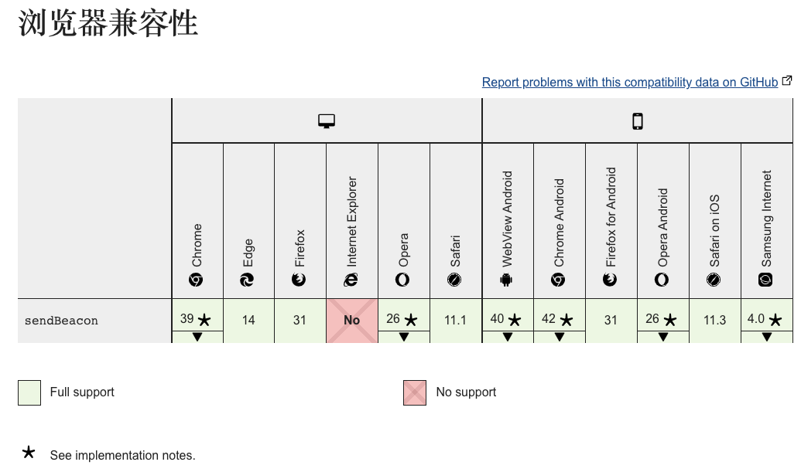

---

title: 前端埋点方案——数据发送
date: 2022-11-30
---​

​ web 前端做埋点方案设计时，最基本的功能就是将采集的数据发送到服务端，常见的埋点 SDK 一般会有三种方式进行数据上报：

​ 1）传统的 ajax 请求；

​ 2）使用图片标签``进行请求；

​ 3）web beacon 发起请求

​ 这三种方式各有优劣之处，最近初步研究数数和神策的 js-sdk，发现三种方式都采用了，由接入方自行选择请求方式。我们就一起来看看这三种方式各自实现的思路以及优劣

### 一、传统的 ajax 请求

#### 1、基本使用

这种最为简单，与平时业务发请求思路没什么区别，使用浏览器自带的`XMLHttpRequest`对象创建 ajax 对象，进行接口请求即可。如：

```typescript
const xhr = new XMLHttpRequest();

xhr.onreadystatechange = () => {
  //	状态处理
};

xhr.open('post', '请求地址', true);

xhr.setRequestHeader('content-type', 'application/json');

xhr.send(JSON.stringify(params));
```

#### 2、优势

​ 1）使用 POST 的话，可以上报的数据体积上还是比较有优势的；

​ 2）默认是异步请求，所以并不会阻塞页面，但相应的就需要占一些客户端资源。

#### 3、劣势

​ 1）受跨域限制，往往做 sdk 的话，上报数据的服务器地址和客户端肯定是不同源的，这就意味着一定会出现跨域问题，就需要添加白名单，某种意义上不是太安全；

​ 2）ajax 不支持在页面关闭后发送数据，也就是说如果在页面卸载时使用 ajax 发送数据，可能会发送不成功。

### 二、使用图片发送请求

#### 1、基本使用

image 方式是通过将采集的数据**拼接**在图片请求的后面，向服务端请求一个 1\*1 px 大小的图片实现的，设置它的 **src 属性**就可以发送数据。

```javascript
var img = new Image();
img.width = 1;
img.height = 1;
img.src = '/test?data=xxx';
```

#### 2、优势

​ 天然可跨域，兼容所有浏览器，没有阻塞问题

#### 3、劣势

​ 图片发起请求，本质是是一个 GET 请求，所以对上报的数据量是有限制的，一般为 2~8 kb。

### 三、优雅的 web Beacon

#### 1、基本使用

​ **navigator.sendBeacon** 是一个比较新的 API，它是指浏览器通过异步的 post 方式发送数据到服务端。

该方法在页面跳转、刷新、关闭页面时发送请求，可以保证数据发送不易丢失，浏览器会对其进行调度以保证数据有效送达，并且不会阻塞页面的加载或卸载。

不受跨域限制，浏览器兼容性较好，可以支持除 IE 之外的几乎所有浏览器



```
navigator.sendBeacon(url, data);
```

- url：data 将要被发送到的网络地址；
- data：将要发送的 ArrayBufferView、Blob、DOMString 或者 FormData 类型的数据；
- 返回值：当用户代理成功把数据加入传输队列时，sendBeacon() 方法将会返回 true，否则返回 false。

#### 2、特点

1、发出的是异步请求，并且是`POST`请求，后端解析参数时，需要注意处理方式；

2、发出的请求，是放到的浏览器任务队列执行的，脱离了当前页面，所以不会阻塞当前页面的卸载和后面页面的加载过程，用户体验较好；

3、只能判断出是否放入浏览器任务队列，不能判断是否发送成功；

4、`Beacon API`不提供相应的回调，因此后端返回最好省略`response body`。

#### 3、兼容处理

虽然现代浏览器对 sendBeacon 的支持很好，但也需要做兼容性处理。

需要判断用户当前设备是否支持 sendBeacon，如果不支持做降级处理，使用其他方式

### 四、综合使用

​ 在 sdk 设计时，我们可以先判断用户设备是否支持 sendBeacon，如果支持，优先考虑该方法，如果不支持，我们先降级到 img 的方式，这里需要提前判断一下数据大小，数据量合适的话，就动态创建 img 来数据上报，过大时，再使用 ajax 做数据上报处理。
